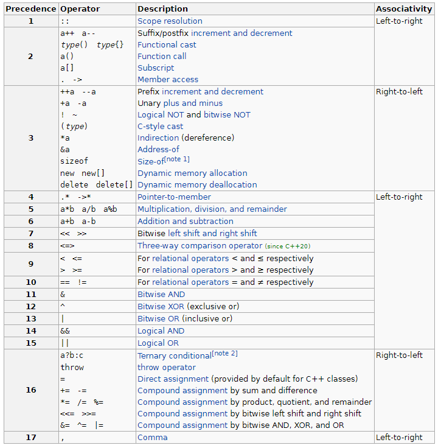

#  Предефиниране на оператори. Жизнен цикъл на обектите - конструктори, деструктор. Капсулация. Класове. Голяма тройка/четворка (rule of three/four).
## Предефиниране на оператори.
Предефинирането на оператори ни позволява да дефинираме поведение на оператор, който да се прилага върху аргументи от даден тип. Операторите всъщност представляват функции със специални имена - ключовата дума *operator*, последвана от символите на оператора. Такива имена са например *operator++*, *operator-=* и т.н. 
### Характеристики и видове оператори
Всеки оператор се характеризира със следните свойства:
- асоциативност
  - лява - тогава изразът приема вида (((a~b)~c)~d)~f)
  - дясна - тогава изразът приема вида (a~(b~(c~(d~f))))
- приоритет
- брой аргументи (операнди)
  - унарни (с 1 аргумент) +, -, *, !, ++, --
  - бинарни (с 2 аргумента) +, -, *, /, %, всички за сравнение, &&, ||, всички за присвояване
  - тернарен (с 3 аргумента) ще бъде разгледан по-напред в курса
- позиция спрямо аргументите (операндите) си
  - префиксен
  - инфиксен
  - суфиксен
 

 
При бинарните оператори левият аргумент (операнда) се подава като първи аргумент, а десният - като втори. С изключение на function call оператора *operator()*, всички предефинирани оператори приемат някакъв брой параметри.  
Ако един предефиниран параметър се дефинира като член-функция на клас/структура, то левият аргумент бива директно асоцииран с обекта, върху който се извиква функцията, т.е. с **this**, като в този случай оператора има с един по-малко параметри. </br>
Важно е да се отбележи, че можем да предефинираме само вече съществуващи оператори и не можем да създаваме нови оператори.
Също, друго важно наблюдение е, че четирите символа +,-,* и & са както унарни, така и бинарни оператори - всеки от тях може да бъде предефиниран, като броят параметри определя кой точно оператор влиза в употреба.

```c++
#include <iostream>

struct ComplexNumber {
	int real;
	int imaginary;

	ComplexNumber operator-() const {
		ComplexNumber result = *this;
		result.real *= -1;
		result.imaginary *= -1;
		return result;
	}

	ComplexNumber operator-(const ComplexNumber& other) const {
		ComplexNumber result = *this;
		result.real -= other.real;
		result.imaginary -= other.imaginary;
		return result;
	}
};

int main() {
	ComplexNumber a{ 1, 2 };
	ComplexNumber b{ 3, 5 };

	ComplexNumber negate_a = -a; // -1, -2
	ComplexNumber subtraction = a - b; // -2, -3
} 
```

При предефинирането на оператор НЕ МОЖЕМ да се променяме асоциативността, приоритета, броят и позицията на аргументите му. </br>

Нека разгледаме този пример за структура, описваща алгебричен вектор и реализирани операциите умножение със скалар и покомпонентно умножение с друг вектор.
```c++
#include <iostream>

struct Vector {
	unsigned elements[100];

	Vector operator*(unsigned scalar) const {
		Vector new_data = *this;
		for (unsigned i = 0; i < 100; i++) {
			new_data.elements[i] *= scalar;
		}
		return new_data;
	}

	Vector operator*(const Vector& other) const {
		Vector new_data = *this;
		for (unsigned i = 0; i < 100; i++) {
			new_data.elements[i] *= other.elements[i];
		}
		return new_data;
	}

	void print() const {
		for (unsigned i = 0; i < 100; i++) {
			std::cout << elements[i] << " "; 
		}
		std::cout << std::endl;
	}
};

int main() {
	Vector v{ {1, 2, 3} };
	v.print(); // 1, 2, 3, 0, 0, ....

	Vector new_vector = v * 3;
	new_vector.print(); // 3, 6, 9, 0, 0, ...

	Vector prod = v * new_vector;
	prod.print(); // 3, 12, 27, 0, 0, ...
} 
```

Тъй като като всяка член-функция операторите също получават за първи параметър указател this, обектът, от който е извикан операторът, ще стои винаги от лявата страна на бинарен оператор. Това би било неестествено в някои случаи, какъвто е и нашия - именно в алгебрата сме свикнали при умножение на вектор със скалар скаларът да седи преди вектора, а не след него. Тоест, по-често срещано е $`scalar * (a_1, a_2, ..., a_n)`$, вместо $`(a_1, a_2, ..., a_n) * scalar`$. Ако обаче пробваме да разменим скалара и вектора в нашата програма ще видим грешка, тъй като компилаторът очаква да види първо вектора и после скалара. </br>
Именно за решение на този проблем можем да предефинираме оператори и извън класа, като по този начин имаме свободата да подадем текущия обект и като десен аргумент на оператора:
```c++
#include <iostream>

struct Vector {
	unsigned elements[100];

	Vector operator*(const Vector& other) const {
		Vector new_data = *this;
		for (unsigned i = 0; i < 100; i++) {
			new_data.elements[i] *= other.elements[i];
		}
		return new_data;
	}

	void print() const {
		for (unsigned i = 0; i < 100; i++) {
			std::cout << elements[i] << " "; 
		}
		std::cout << std::endl;
	}
};

Vector operator*(unsigned scalar, const Vector& v) {
	Vector new_data = v;
	for (unsigned i = 0; i < 100; i++) {
		new_data.elements[i] *= scalar;
	}
	return new_data;
}

int main() {
	Vector v{ {1, 2, 3} };
	v.print(); // 1, 2, 3, 0, 0, ....

	Vector new_vector = 3 * v;
	new_vector.print(); // 3, 6, 9, 0, 0, ...
} 
```
**Важно:** Има оператори, които не могат да бъдат дефинирани като външни функции, а трябва да бъдат задължително член-функции. Такива са операторите *=, [], (), ->, ->**
```c++
struct ComplexNumber {
	int real;
	int imaginary;
};

ComplexNumber operator=(ComplexNumber& a, const ComplexNumber& b) { // compile-time error - must be a member function
	// ...
}
```

## Жизнен цикъл на един обект
Жизненият цикъл на един обект протича по следния начин:
- в дадена област на видимост (scope) се създава обект
- в един или друг момент се достига до края на областта на видимост
- обектът и паметта, която той притежава, се "разрушават"

Създаването на обекти се извършва със специални член-функции, наречени **конструктори**. Всеки конструктор има същото име като класа/структурата, в която се съдържа, и се извиква веднъж - при създаването на обекта. Използват се за задаване на стойности на член-данните на класа. </br>

Разрушаването на обекти се извършва със специална член-функция, наречена **деструктор**. Деструкторът има същото име като класа/структурата, в която се съдържа, но с тилда (~) отпред. Въпреки че можем да имаме произволен брой конструктори, деструкторът е един. Неговата цел е да освободи (най-често чрез delete) динамично заделена памет.

```c++
#include <iostream>

struct Test {
	Test() {
		std::cout << "Inception" << std::endl;
	}
	~Test() {
		std::cout << "The destroyer of worlds" << std::endl;
	}
};

int main() {
	{
		Test t; // Created object t
		{
			Test t2; // Created object t2
		} // Destroyed object t2
	} // Destroyed object t
}
```

### Конструктори и деструктори при влагане на обекти
При влагането на обекти конструкторите на член-данните се извикват в началото на конструктора на класа, който ги съдържа (още преди влизане в тялото на конструктора), в реда, в който са дефинирани в класа.
Деструкторите пък се извикват в края на деструктора на класа, който ги съдържа (след края на тялото на деструктора), в обратен ред на този, в който са дефинирани в класа.
```c++
#include <iostream>

struct A {
	A() {
		std::cout << "A()" << std::endl;
	}
	~A() {
		std::cout << "~A()" << std::endl;
	}
};

struct B {
	B() {
		std::cout << "B()" << std::endl;
	}
	~B() {
		std::cout << "~B()" << std::endl;
	}
};

struct C {
	C() {
		std::cout << "C()" << std::endl;
	}
	~C() {
		std::cout << "~C()" << std::endl;
	}
};

struct CompositeTest {
	A first_obj;
	B second_obj;
	C objArray[4];

	CompositeTest() { // A(), B(), C(), C(), C(), C()
		std::cout << "X()" << std::endl;
	}
	~CompositeTest() {
		std::cout << "~X()" << std::endl;
	} // ~C(), ~C(), ~C(), ~C(), ~B(), ~A()
};

int main() {
	CompositeTest obj; //CompositeTest obj is created
} // CompositeTest obj is destroyed
```

## Капсулация
Капсулацията (известно още като *скриване на информация*) е един от основните принципи в ООП (заедно с абстракцията, наследяването и полиморфизма). Именно тя налага да разбием една структура на интерфейс и имплементация. Понякога бихме искали потребителите на класа да нямат достъп до всички негови член-данни и методи.
Това е така, защото промяна на член-данните понякога би довела до неочаквано поведение. Принципът за капсулация ни помага, позволявайки да определим точно кои методи и атрибути може да бъдат достъпвани потребителите на нашия клас.
</br>
Капсулацията се постига чрез така наречените модификатори за достъп, които определят кой точно може да достъпва дадени член-данни или функции. В C++ модификаторите за достъп са 3:
- *private* - член-данната или член-функцията може да се достъпва само в текущия клас
- *protected* - член-данната или член-функцията може да се достъпва само в текущия клас или в наследниците му
- *public* - член-данната или член-функцията може да се навсякъде

```c++
#include <iostream>

struct TestCapsulation {
private:
	unsigned a;
	void f() {
		a; // ok
		b; // ok 
		c; // ok
	}
protected:
	unsigned b;
	void g() {
		a; // ok
		b; // ok 
		c; // ok
	}
public:
	unsigned c;
	void h() {
		a; // ok
		b; // ok 
		c; // ok
	}
};

int main() {
	TestCapsulation obj;
	obj.a; // compile-time error - access outside of class (private member)
	obj.b; // compile-time error - access outside of class (protected member)
	obj.c; // ok

	obj.f(); // compile-time error - access outside of class (private member)
	obj.g(); // compile-time error - access outside of class (protected member)
	obj.h(); // ok
} 
```

## Класове
Използвайки класове можем да си дефинираме собствени типове данни, подобно на това как работихме със структури досега. Съществената разлика между клас и структура е, че при класът всички член-данни и член-функции са по подразбиране private, докато при структурите те са по подразбиране public. </br> Има и други разлики, свързани с концепцията за наследяване, но тях ще разгледаме по-нататък в курса.

```c++
#include <iostream>

struct TestStruct {
	unsigned a;
	void f() {

	}
};

class TestClass {
	unsigned a;
	void f() {

	}
};

int main() {
	TestStruct testStruct;
	testStruct.a; // ok - default access modifier is public
	testStruct.f(); // ok - default access modifier is public

	TestClass testClass;
	testClass.a; // compile-time error - inaccessible, since default access modifier is private
	testClass.f(); // compile-time error - inaccessible, since default access modifier is private
} 
```

## Копиращ конструктор и operator=
**Копиращ конструктор** - приема обект от същия клас и текущият става негово копие
```c++
class A {
public:
    A(const A& other) {
        // copy logic
    }
};
```

**Ако не го разпишем компилаторът създава такъв! Той извиква рекурсивно копиращите конструктори на член-данните, които са от съставен тип, а примитивните типове данни ги копира по стойност.**

Можем да го извикаме по следните начини:
```c++
class A {
public:
    A() {
        std::cout << "A()" << std::endl;
    }

    A(const A& other) {
        std::cout << "A(const A&)" << std::endl;
    }
};

void f(A a) {...}

int main() {
    A obj; // A()
    A obj1 = obj; // A(const A&)
    A obj2(obj); // A(const A&)
    f(obj); // A(const A&)
}
```

Пример с член-данни:
```c++
class B {
public:
    B() {
        std::cout << "B()" << std::endl;
    }

    B(const B& other) {
        std::cout << "B(const B&)" << std::endl;
    }
};

class A {
public:
    B b;

    A() {
        std::cout << "A()" << std::endl;
    }

    // внимание: тук ако не използваме инициализиращ списък, понеже сме разписали
    // копиращия конструктор на А сами, ще се извиква дефолтен на В
    // затова трябва да го извикаме експлицитно чрез иниц. списък
    // ако оставим компилаторът да го разпише сам, това се случва автоматично
    A(const A& other) : b(other.b)
        std::cout << "A(const A&)" << std::endl;
    }
};

class C {
    B b;
};

int main() {
    A obj1;        // B() -> A()
    std::cout << "----" << std::endl;

    A obj2 = obj1; // B(const B&), A(const A&)

    C c;
    C c1 = c; // B(const B&) и за С не се отпечатва, понеже не сме го разписали
}
```

**operator=** - функция/оператор
- Приема обект от същия тип и текущият става негово копие
- Текущият обект трябва да е съществувал преди това

**Ако не го разпишем то компилаторът отново създава такъв, викайки operator= рекурсивно върху член-данните на нашия клас.**  
**Копиращият конструктор създава нов обект, а оператор= модифицира вече съществуващ такъв.**

```c++
class A {
public:
    A() = default;

    A(const A& other) {
        std::cout << "A(const A&)" << std::endl;
    }

    A& operator=(const A& other) {
        std::cout << "operator=(const A&)" << std::endl;
    }
};

int main() {
    A obj; // A()
    A obj1 = obj; // A(const A&) - въпреки че сме използвали =, тук се извика коп. констр., защото тепърва създаваме обекта
    А obj2; // A()
    obj2 = obj1; // operator=(const A&)
}
```

Пример с член-данни:
```c++
class B {
public:
    B() {
        std::cout << "B()" << std::endl;
    }

    B(const B& other) {
        std::cout << "B(const B&)" << std::endl;
    }

    B& operator=(const B& other) {
        std::cout << "operator=(const B&)" << std::endl;
        return *this;
    }
};

class A {
public:
    B b;
    // не сме разписали operator=
};

int main() {
    A obj1; // B()

    A obj2; // B()

    obj2 = obj1; // operator=(const B&) - извикан от operator= на А
}
```

## Проблем с генерираните от компилатор копиращ конструктор и operator=
Нека имаме следния клас:
```c++
class Person {
private:
    char* name;
    int age;

public:
    Person(const char* name, int age) {
        this->name = new char[strlen(name) + 1];
        strcpy(this->name, name);
        this->age = age;
    }

    ~Person() {
        delete this->name;
    }
};
```
В този случай компилаторът ни генерира копиращ конструктор и operator=, както винаги, но ще копира член-данните по стойност (типът int и указателят са примитивни типове). При следния код:
```c++
int main() {
    Person p1("Mitko", 20);
    Person p2 = p1; // коп. констр.
}
```
Копират се член-данните по стойност. Стойността на указател е адрес, следователно и двата обекта от тип Person ще имат указател, който сочи към една и съща памет (това се нарича shallow copy). Така в края на областта на видимост (scope), в който е дефиниран дадения обект (тоест, в случая, при затварящата скоба `}` на `main()`) ще се извикат техните деструктори и ще се опитат да изтрият една и съща памет, което най-вероятно ще накара програмата да крашне, а в някои случаи води до трудно откриваеми бъгове.

Поради този проблем за всеки клас, който работи с динамична памет, ни се налага да разписваме тези функции сами - копиращ конструктор, operator= и деструктор (rule of three).

Коректният клас Person ще изглежда по следният начин:
```c++
class Person {
private:
    char* name;
    int age;

public:
    Person(const char* name, int age) {
        this->name = new char[strlen(name) + 1];
        strcpy(this->name, name);
        this->age = age;
    }

    Person(const Person& other) {
        copyFrom(other);
    }

    Person& operator=(const Person& other) {
        if(this != &other) {
            free();
            copyFrom(other);
        }
        return *this;
    }

    ~Person() {
        free();
    }

private:
    void free() {
        delete[] name;
        name = nullptr;
        age = 0;
    }

    void copyFrom(const Person& other) {
        name = new char[strlen(other.name) + 1];
        strcpy(name, other.name);
        age = other.age;
    }
};
```

Тук е изнесена логика във две private функции за триене и копиране, просто за да не я повтаряме в копиращия конструктор и operator=.  
Проверяваме дали адресите на обекта, чиято стойност присвояваме, се различават (тоест дали `this != &other`), за да избегнем self-assignment (присвояване на обекта към самия себе си), което може да доведе до изтриване на данните преди изобщо да сме ги копирали.
Operator= връща референция към текущия обект, за да позволи верижно присвояване (напр. `a = b = c`, както сте правили и по УП с числа). Да напомним, че поради дясната асоциативност на оператор=, оценяването на горния израз ще бъде `(a = (b = c))`, тоест първо ще се изпълни оператор= за b и c, а след това ще се изпълни оператор= за a и резултата от `b = c` (който е референция към b).
